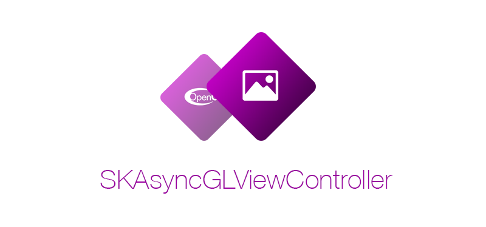
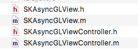

<p align="center">
  
</p>


<p align="center">
<a href="https://travis-ci.org/stephenkopylov/SKAsyncGLViewController"></a>
<a href="http://cocoapods.org/pods/SKAsyncGLViewController"></a>
<a href="http://cocoapods.org/pods/SKAsyncGLViewController"></a>  
<a href="http://cocoapods.org/pods/SKAsyncGLViewController"></a>  
</p>

SKAsyncGLViewController - replacement for classical GLKit stack (GLKView + GLKViewController). 

It renders all your stuff in background GCD-thread and shows result on main thread.

**OpenGLES2/OpenGLES3**


### Install
#### CocoaPods
```ruby
pod "SKAsyncGLViewController"
```

#### Manual
Download this repo and drop this files into your project



### Usage
After installation, inherit your viewController from SKAsyncGLViewController and implement these methods:

:wrench: Select your API version by returning EAGLRenderingAPI value here (default is kEAGLRenderingAPIOpenGLES3)
- **- (EAGLRenderingAPI)getApi**

- **- (void)setupGL** 

:wrench: This one for setup your GL - create buffers/load shaders/etc here.
- **- (void)drawGL:(CGRect)rect**

:black_nib: :pencil2: Here you draws all your stuff!
- **- (void)clearGL**

:x: This method calls when your vc's view removes from superview. So here you have to clear all your gl stuff (delete buffers .etc)


You can access framebuffer, renderbuffer and background queue through view's properties.


### License
The MIT License (MIT)

Copyright (c) 2016-2019 Stephen Kopylov, newonxp@gmail.com

Permission is hereby granted, free of charge, to any person obtaining a copy of
this software and associated documentation files (the "Software"), to deal in
the Software without restriction, including without limitation the rights to
use, copy, modify, merge, publish, distribute, sublicense, and/or sell copies of
the Software, and to permit persons to whom the Software is furnished to do so,
subject to the following conditions:

The above copyright notice and this permission notice shall be included in all
copies or substantial portions of the Software.

THE SOFTWARE IS PROVIDED "AS IS", WITHOUT WARRANTY OF ANY KIND, EXPRESS OR
IMPLIED, INCLUDING BUT NOT LIMITED TO THE WARRANTIES OF MERCHANTABILITY, FITNESS
FOR A PARTICULAR PURPOSE AND NONINFRINGEMENT. IN NO EVENT SHALL THE AUTHORS OR
COPYRIGHT HOLDERS BE LIABLE FOR ANY CLAIM, DAMAGES OR OTHER LIABILITY, WHETHER
IN AN ACTION OF CONTRACT, TORT OR OTHERWISE, ARISING FROM, OUT OF OR IN
CONNECTION WITH THE SOFTWARE OR THE USE OR OTHER DEALINGS IN THE SOFTWARE.

